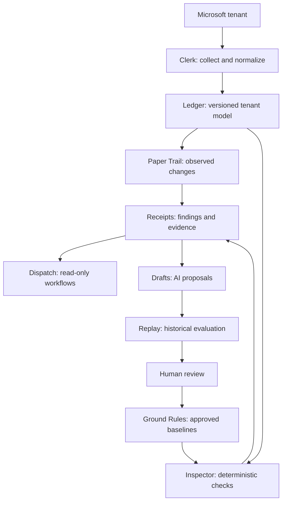

# Petty.

## It keeps receipts.

Agentless, read-only Microsoft 365 security monitoring with deterministic checks and configuration history in Git.

Petty is being designed to check supported tenant configuration against approved standards, track observed changes, and preserve the evidence behind each finding.

- **It's petty about details.** One misconfigured Conditional Access policy matters.
- **It keeps receipts.** Findings reference the configuration, rule version, and evidence behind them.
- **It holds you to standards.** Versioned, deterministic checks produce reproducible decisions.
- **It doesn't interfere.** The monitor observes and reports without changing tenant settings.

**AI proposes better checks. Petty tests them before they become the standard.**

## Project status

**Repository foundation.** This repository contains the product documents and TypeScript tooling with a help/version-only CLI. Tenant collection, security checks, and production deployment are not implemented yet.

Milestones 0 through 2 are complete: architecture, product scope, threat model, and the verified TypeScript foundation. Next is M03: shared versioned data contracts. We will build one milestone at a time, with reviewable changes and explicit completion gates.

The first prototype will use synthetic snapshots of Conditional Access policies, protected role assignments, and the identities needed to interpret them. Coverage will be documented per resource and property. A supported resource is not a claim that Petty can export, restore, or inspect an entire tenant.

## The big picture

Petty answers four questions:

1. What changed?
2. Does it violate an approved policy?
3. Which identities or resources are affected?
4. What should happen next?



The shared tenant model is the bookshelf. Tenant resources and relationships are the books. Clerk updates the shelf; the other modules read it.

## Components

| Component        | Responsibility                                                                    |
| ---------------- | --------------------------------------------------------------------------------- |
| **Clerk**        | Collect and normalize configuration, recording coverage and failures.             |
| **Ledger**       | Store the tenant model, relationships, fingerprints, and Git history.             |
| **Ground Rules** | Define approved policies and configuration baselines.                             |
| **Paper Trail**  | Identify meaningful changes and deviations from approved state.                   |
| **Inspector**    | Evaluate deterministic security configuration checks.                             |
| **Guest List**   | Review identities, memberships, and protected access.                             |
| **Signals**      | Correlate supported authentication and audit activity with configuration history. |
| **Triage**       | Prioritize findings using explicit criteria and, later, vulnerability context.    |
| **Receipts**     | Explain findings and record evidence and decision provenance.                     |
| **Dispatch**     | Coordinate read-only investigation, enrichment, and configured delivery.          |
| **Drafts**       | Propose improvements to checks, priorities, and workflows using AI.               |
| **Replay**       | Evaluate changes against historical snapshots and regression cases.               |

These are modules of one application. They do not need to be separate services.

## Architecture decisions

- **Language:** TypeScript.
- **Production runtime:** Node.js LTS; the foundation pins 24.21.0.
- **Packaging:** Docker, with Docker Compose as the initial self-hosted deployment.
- **Managed deployment target:** Azure Container Apps and Container Apps Jobs.
- **Configuration evidence:** canonical structured files and Git history.
- **Decision execution:** deterministic, versioned checks.
- **AI:** bounded proposals and evaluation outside routine decision execution.

The foundation uses npm 11.19.0, TypeScript 7.0.2, Prettier 3.9.9, and Node's built-in test runner. API/UI frameworks, operational database, and AI provider remain open. The source-code license is MIT.

## Try the foundation

Use the pinned Node/npm versions, then run:

```sh
npm ci --ignore-scripts
npm run check
npm start -- --help
```

This runs the foundation checks and CLI help without credentials. See [development instructions](docs/DEVELOPMENT.md) for commands and supported behavior.

## What a receipt records

A finding should identify the tenant and resource, the relevant relationship path, the observed and expected values, the snapshot fingerprint and collection interval, the baseline and rule versions, and the decision and supporting evidence. Engine, schema, and reference-data versions must make historical evaluation reproducible.

Collection time is an observation interval, not proof of the precise time or actor behind a tenant change. Git history can be rewritten; stronger integrity controls must follow the threat model.

## Product boundaries

- Tenant collection is read-only. Writing snapshots to a repository and recording Petty's own job state are separate operations.
- Changes between observations may be missed. Approved baselines determine policy drift; yesterday's state is not automatically acceptable.
- Incomplete or unauthorized collection means unknown coverage, not a passing check or a deleted resource.
- Findings show policy judgments supported by evidence. A configuration change alone does not establish compromise or effective policy enforcement.
- Real tenant snapshots belong in controlled private repositories. Public examples must be synthetic.
- Active remediation is a separate future product decision; it is not part of the current monitor.

## Project documents

- [Roadmap](ROADMAP.md): milestones 0 through 43 and completion gates.
- [Product contract](docs/PRODUCT_CONTRACT.md): initial operator, scale, timing, ownership, and lifecycle targets.
- [Coverage](docs/COVERAGE.md): planned resource/property allowlist and the three initial checks.
- [Threat model](docs/THREAT_MODEL.md): trust boundaries, risks, and required verification gates.
- [Acceptance cases](docs/ACCEPTANCE_CASES.md): synthetic behavioral specifications for later implementation.
- [Architecture](docs/ARCHITECTURE.md): module boundaries, data flow, and invariants.
- [Architecture decisions](docs/decisions/README.md): accepted architecture and initial product scope.
- [Development](docs/DEVELOPMENT.md): pinned setup, scripts, tests, and CI.
- [Contributing](CONTRIBUTING.md): how to work one milestone at a time.
- [Security](SECURITY.md): reporting and data-handling guidance.
- [Agent instructions](AGENTS.md): implementation guidance for coding agents.

## License

[MIT](LICENSE). Public source examples are synthetic; this license does not authorize access to an organization's tenant or private evidence.
